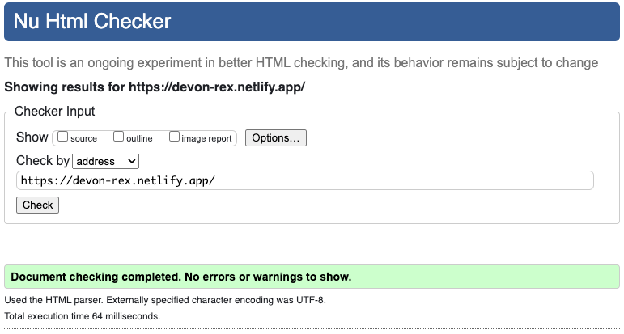
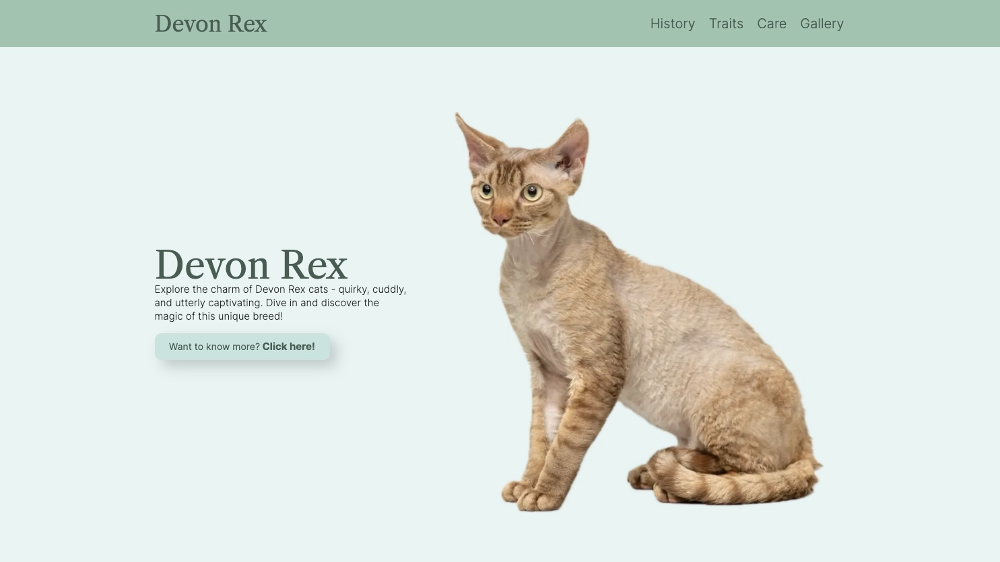
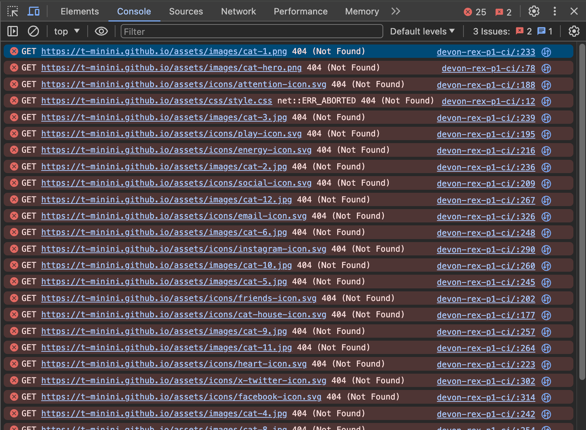

# Devon Rex 

## Description

Discover all things Devon Rex — history, traits and care tips for this enchanting cat breed.


You can visit the live website [here!](https://devon-rex.netlify.app/)

## **Design**

### **Colours**


### **Typography**

- All icons were sourced though [Iconify](https://www.figma.com/community/plugin/735098390272716381/iconify) Figma plugin and [Font Awesome](https://fontawesome.com/)
- All fonts were sourced through [Google Fonts](https://fonts.google.com/)
- [Libre Caslon Text](https://fonts.google.com/specimen/Libre+Caslon+Text)
- [Inter](https://fonts.google.com/specimen/Inter)


### **Wireframe and Prototype**

### [Balsamiq](https://balsamiq.com/) wireframe:

<details>
<summary> Open for desktop wireframe </summary>


</details>

### [Figma](https://www.figma.com/) prototype:

<details>
<summary> Open for desktop prototype </summary>


</details>

<details>
<summary> Open for mobile prototype </summary>


</details>

## Testing

Responsiveness has been checked and adjusted in Chrome Dev Tools and the site has been viewed on mobiles and desktop without issues and the following browsers:

- Chrome

- Safari

- Firefox

### **HTML Validation**

All HTML code has been run through the [W3C - HTML](https://validator.w3.org/) validator. Results can be found below.


### **CSS Validation**

All CSS code has been run through the [W3C - CSS](https://jigsaw.w3.org/css-validator/) validator. Results can be found below.


### **Google Lighthouse**

The lighthouse score results can be found below.


### **WAVE Accessibility Evaluation**

The WAVE accessibility evaluation tool results can be found below.




### **Manual Testing**

| Features         | Expected Outcome                                                           | Test Performed                                | Results                                                          | Pass/Fail |
| ---------------- | -------------------------------------------------------------------------- | --------------------------------------------- | ---------------------------------------------------------------- | --------- |
| **Navbar**       |
| Devon Rex        | When clicked, the page should scroll up to the top of the page             | Clicked "Devon Rex" in the Navbar             | Page scrolled up to the top of the page                          | Pass      |
| History          | When clicked, the page should scroll up or down to the History section     | Clicked "History" in the Navbar               | Page scrolled up and down to the History section                 | Pass      |
| Traits           | When clicked, the page should scroll up or down to the Traits section      | Clicked "Traits" in the Navbar                | Page scrolled up and down to the Traits section                  | Pass      |
| Care             | When clicked, the page should scroll up or down to the Care section        | Clicked "Care" in the Navbar                  | Page scrolled up and down to the Care section                    | Pass      |
| Gallery          | When clicked, the page should scroll up or down to the Gallery section     | Clicked "Gallery" in the Navbar               | Page scrolled up and down to the Gallery section                 | Pass      |
| Contact          | When clicked, the page should scroll down to the Contact section           | Clicked "Contact" in the Navbar               | Page scrolled down to the Contact section                        | Pass      |
| **Footer**       |
| Devon Rex        | When clicked, the page should scroll up to the top of the page             | Clicked "Devon Rex" in the Contact section    | Page scrolled up to the top of the page                          | Pass      |
| Instagram Icon   | When clicked, the instagram website should open in a new browser tab       | Clicked Instagram icon in the Contact section | A new browser tab was opened with Instagram web page             | Pass      |
| X / Twitter Icon | When clicked, the X / Twitter website should open in a new browser tab     | Clicked X icon in the Contact section         | A new browser tab was opened with X / Twitter web page           | Pass      |
| Facebook Icon    | When clicked, the Facebook website should open in a new browser tab        | Clicked Facebook icon in the Contact section  | A new browser tab was opened with Facebook web page              | Pass      |
| Envelope Icon    | When clicked, the default email app should open in a new window            | Clicked Envelope icon in the Contact section  | A new window was opened with the default email provider app      | Pass      |
| Tulio Minini     | When clicked, should open the developer linkedin page in a new browser tab | Clicked "Tulio Minini" in the Contact section | A new browser tab was opened with the developer linkedin profile | Pass      |

### **Bugs**

**Description:**  
When the project was first deployed, the links to the CSS files and images were not working. This issue did not occur in the local development environment but only after deployment.

<details>
<summary> Click to see images </summary>




</details>

**Steps to Reproduce:**

1. Deploy the project to a web server.
2. Attempt to load the web page.
3. Notice that the CSS styles and images do not load.

**Expected Behavior:**  
The web page should correctly load all CSS styles and images as it does in the local development environment.

**Actual Behavior:**  
The web page fails to load CSS styles and images, resulting in an unstyled page with broken image links.

**Cause:**  
The issue was caused by the use of absolute file paths for the CSS and image links, which worked locally but not in the deployed environment.

**Solution:**  
Replace absolute file paths with relative file paths in the HTML files. For example, change paths from `/path/to/file.css` to `./path/to/file.css` or `path/to/file.css`.

**Example:**

Before:

```html
<link rel="stylesheet" href="/assets/css/style.css" />

```

After:

```html
<link rel="stylesheet" href="assets/css/style.css" />

```

### **Test Final Review**

The testing procedures have been executed, meeting all specified criteria. Results have been thoroughly documented, and any identified issues have been addressed. Post-testing, the website has been confirmed to be fully functional and accessible.

## Tech Stack

This website is developed using the following technologies:

**HTML**: For structuring the content and layout of the web pages.

**CSS**: For styling the website and making it visually appealing.

## Tools Used

This website is developed using the following tools:

**GitHub**: Used for version control and code storage. GitHub allows for collaborative development, issue tracking, and code review, ensuring a smooth workflow and version management.

**Netlify**: Used to deploy the website. Netlify offers seamless continuous deployment and provides a range of features such as form handling, serverless functions, and a global CDN for fast content delivery.

**VS Code**: Integrated Development Environment (IDE) used to write, edit, and debug code. VS Code supports numerous extensions that enhance productivity, such as Git integration, syntax highlighting, and linting tools.

**Google DevTools**: A set of web developer tools built directly into the Google Chrome browser. Google DevTools provides features for debugging, editing CSS and HTML on the fly, and analyzing website performance.

**Google Fonts**: A library of over a thousand free and open-source font families. Google Fonts ensures consistent and aesthetically pleasing typography across different browsers and devices.

**Font Awesome**: A toolkit for using icons and social logos on your website. Font Awesome icons are vector-based, which makes them highly customizable in terms of size, color, and positioning.

**Figma**: A web-based design tool used for creating user interfaces and prototyping. Figma enables real-time collaboration, making it easy to gather feedback and iterate on design ideas.

**Balsamiq**: A wireframing tool used to create low-fidelity mockups. Balsamiq helps in quickly visualizing the structure and layout of web pages before moving on to high-fidelity design.

**W3C Markup Validation Service**: A tool provided by the World Wide Web Consortium (W3C) to validate HTML and XHTML documents. This service checks for errors in the markup to ensure compliance with web standards.

**W3C CSS Validation Service**: A tool provided by W3C to validate CSS code. It helps in identifying errors and potential issues in the stylesheet, ensuring it adheres to CSS standards.

**WAVE Accessibility**: A web accessibility evaluation tool. WAVE helps in identifying accessibility issues on web pages, ensuring they are accessible to users with disabilities.

**Google Lighthouse**: An open-source, automated tool for improving the quality of web pages. Lighthouse audits performance, accessibility, SEO, and other best practices, providing insights and recommendations for improvement.

**Prettier**: A code formatter that enforces a consistent style by parsing your code and re-printing it with its rules. Prettier helps maintain clean and readable code throughout the project.

**Birme**: An online bulk image resizing tool. Birme is used to resize images quickly and efficiently, ensuring that they are optimized for the web without compromising on quality.

**LinkedIn Post Inspector**: Post Inspector can help you identify the data missing on your page, and what you need to add for your content to have better previews in posts.

Each of these tools plays a crucial role in the development, deployment, and maintenance of the website, contributing to its overall quality and user experience.

## Credits

All images used in this project are credited to their respective authors. You can find the author information by hovering over each image, where the title attribute displays the credit.

Credits to: shutterstock.com @malee2, @Veera, Unsplash - @ivanlyah, Pinterest - @devonresale, @artiepaws, @estherbarcomb, @ruto_boomeowbooo, @anechka_mardar, stock.adobe.com - @aylabaha, @veera, @annaav, Getty Images/Canva Pro, Instagram - @devonrexsharing, TikTok - @user13663e.
